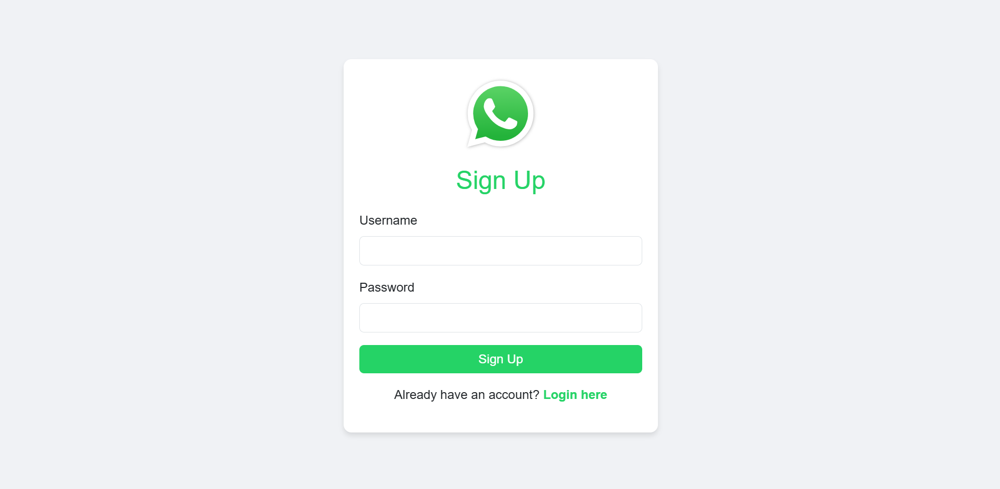
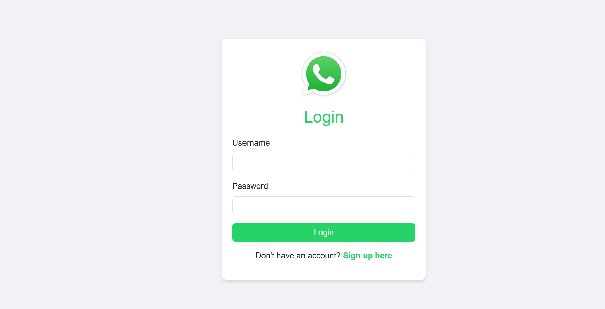
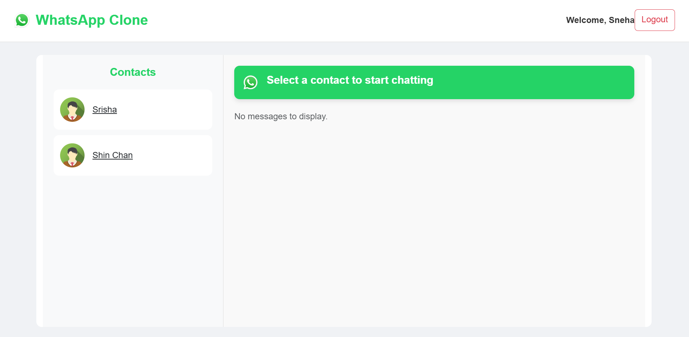
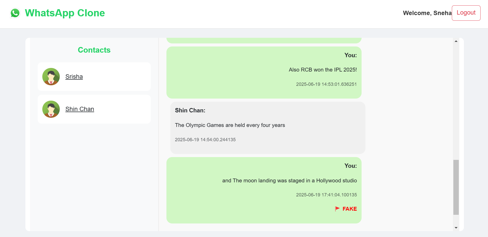
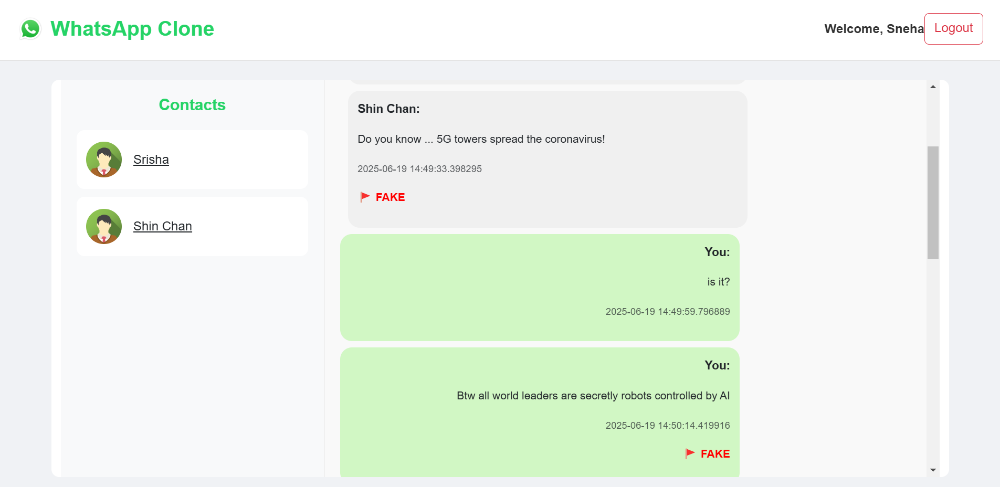
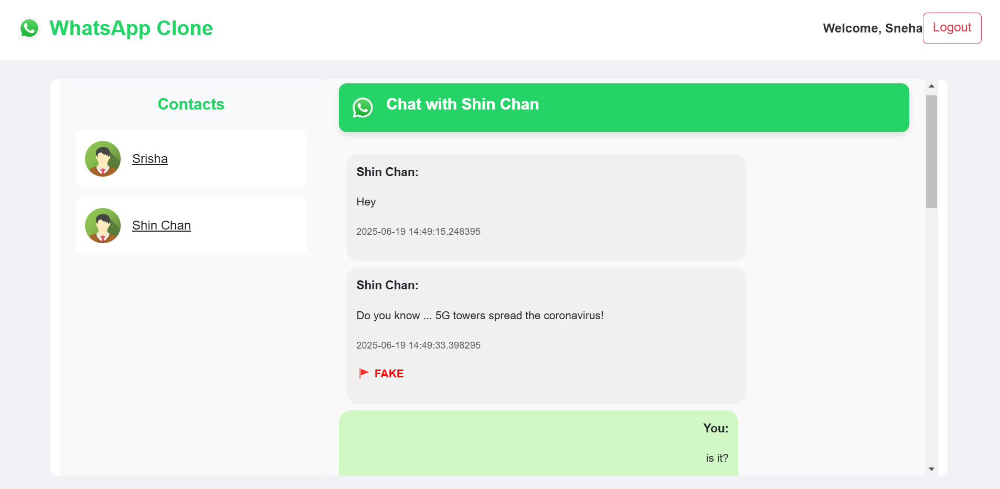

# WhatsApp Clone with Fake News Detection
## Overview
This project is a WhatsApp Clone enhanced with a Fake News Detection System using Natural Language Processing (NLP) and Machine Learning (ML) techniques. It aims to help curb the spread of misinformation through instant messaging platforms by classifying messages as "FAKE" or "REAL".

Explore the live demo here: 
https://whatsapp-clone-a4to.onrender.com

(_Note: If you see a "Dangerous site" warning in Chrome, try opening the link in incognito mode.
This warning is a false positive — the site does not contain any malicious content. It's a temporary issue sometimes caused by browser cache, certificate propagation delays, or Chrome's overcautious flagging for lesser-known domains._)

# Features
- Real-Time Fake News Detection: Classifies incoming messages as FAKE or REAL based on content analysis.
- Secure Authentication System: User sign-up and login using Flask-Login.
- Instant Messaging: Fully functional messaging system similar to WhatsApp.
- Database Integration: Uses SQLAlchemy to store user and message data.
- Clean UI: Built using Flask templates for a seamless chatting experience.

## Project Highlights
- NLP Pipeline: Preprocessing includes text normalization, tokenization, stopword removal, and lemmatization.
- ML Model: Ensemble model combining Logistic Regression and Multinomial Naive Bayes for balanced precision and recall.
- SMOTE: Handles class imbalance for improved classification accuracy.
- TF-IDF Vectorization: Converts text to numerical features.
- Evaluation Metrics: Accuracy (98%), Precision (1.00 for FAKE), Recall (0.99 for REAL), and F1-Score (0.97 overall).

## Technologies Used
- Backend: Python, Flask, SQLAlchemy
- Frontend: HTML, CSS (Flask templates)
- Machine Learning: Scikit-learn, NLTK

## Installation
### To run this project locally:

Clone the repository:
```bash
git clone https://github.com/your-username/whatsapp-clone-fakenews.git
cd whatsapp-clone-fakenews
```

Set up a virtual environment:
```bash
python -m venv venv
source venv/bin/activate # On Windows: venv\Scripts\activate
```

Install dependencies:
```bash
pip install -r requirements.txt
```

Run the application:
```bash
python app.py
```

Navigate to http://localhost:5000 in your browser.

### Screenshots
Sign-Up Page


Login Page


Chat interface


Chat Interface with Fake News Labeling




## Author
Sneha Yadav
